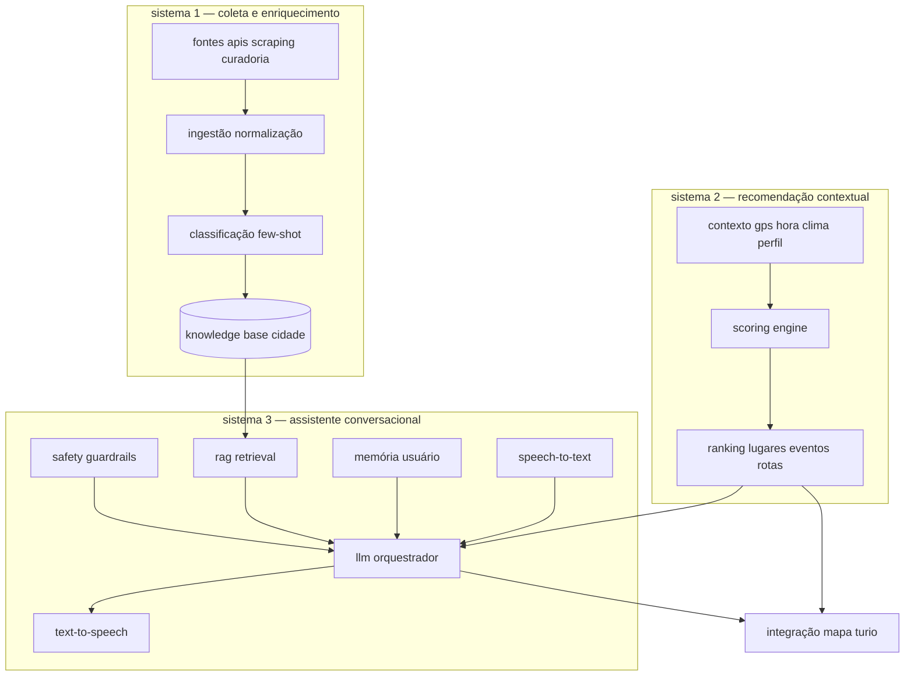

# arquitetura de ia — turio

guia completo dos três sistemas de inteligência artificial do turio: coleta e enriquecimento de dados, recomendação contextual e assistente conversacional. baseado no estado atual do mvp (parser regex em `VoiceAssistant.jsx`) e roadmap até produção plena.

---

## visão geral — três sistemas



| sistema | responsabilidade | consumidor |
|---------|------------------|------------|
| 1 — coleta | transformar dados brutos em knowledge base estruturada | sistemas 2 e 3 |
| 2 — recomendação | ranquear lugares, eventos, modais sem conversa | home, docks, mapa |
| 3 — assistente | diálogo voz/texto, ações no app | VoiceAssistant, chat sheet |

---

## sistema 1 — coleta e enriquecimento de dados

### fontes

| fonte | método | frequência | destino |
|-------|--------|------------|---------|
| openstreetmap overpass | api | on-demand + warm cache | pois, natureza, vias |
| sympla | api backend | 6h | eventos |
| curadoria manual | json `data/poa/raw/` | contínua | lugares verificados |
| rss portais (zh, g1, cultura.rs) | scraping backend | 24h | eventos candidatos |
| google places (opcional) | api paga | semanal | enriquecimento comercial |
| relatos comunidade | api turio | tempo real | alertas, confidence boost |
| weather open-meteo | api | 1h | contexto recomendação |

### pipeline ingestão

```
raw document
  → extract (html/json/rss)
  → normalize schema (place/event)
  → geocode se lat/lon ausente (nominatim)
  → classify category (few-shot llm)
  → compute confidence
  → deduplicate
  → upsert knowledge base
```

### scraping — diretrizes

- respeitar robots.txt e rate limits
- user-agent identificável: `TurioBot/1.0 (+https://turio.app/bot)`
- armazenar `sourceUrl` e `scrapedAt` para auditoria
- fallback humano: fila de revisão embaixador para itens confidence < 0.6

### classificação few-shot (não treinar do zero)

**objetivo:** mapear texto livre (título evento, nome osm, descrição) para categorias do `interestTree.js`.

**abordagem:** prompt llm com exemplos fixos (5–10 por categoria), não fine-tuning inicial.

**prompt template classificação:**

```
você classifica itens urbanos para o app turio em porto alegre.

categorias válidas: cultura, parques, gastronomia, cafes, eventos, saude, educacao, economia, natureza, mobilidade

exemplos:
- "margs exposição arte contemporânea" → cultura
- "feira orgânica bom fim sábado" → economia, eventos
- "praça da matriz" → parques
- "hamburgueria artesanal centro" → gastronomia

item: "{title}"
descrição: "{description}"

responda apenas json: {"categories": ["..."], "tags": ["..."], "confidence": 0.0-1.0}
```

**implementação:** `backend/src/ai/classifyItem.js` — batch async para fila de ingestão; cache resultado por hash do texto.

**evolução fase 4+:** embeddings + classificador leve (logistic regression) treinado nos rótulos do llm para reduzir custo.

### modelo de item enriquecido (knowledge base)

```json
{
  "id": "kb-poa-0042",
  "type": "place",
  "name": "café do mercado público",
  "rawNames": ["Cafe Mercado", "Mercado Público - Café"],
  "categories": ["gastronomia", "cafes"],
  "tags": ["centro-historico", "turismo", "tradicional"],
  "embedding": "[vector 1536 dims — opcional fase 3]",
  "lat": -30.027,
  "lon": -51.228,
  "textForSearch": "café tradicional no mercado público centro histórico porto alegre",
  "metadata": {
    "source": "curated",
    "classifiedBy": "llm-fewshot-v1",
    "confidence": 0.92
  },
  "updatedAt": "2022026-05-20T15:00:00Z"
}
```

---

## sistema 2 — recomendação contextual

### sinais de contexto

| sinal | origem | peso default |
|-------|--------|--------------|
| distância | gps usuário | 0.25 |
| match interesses | UserContext.interests | 0.25 |
| hora do dia | local timezone | 0.15 |
| clima | open-meteo | 0.10 |
| gratuidade | place.freeAccess | 0.10 |
| confidence | pipeline dados | 0.10 |
| popularidade | cliques agregados | 0.05 |

### fórmula de scoring

```javascript
function scoreItem(item, context) {
  const distKm = haversine(context.lat, context.lon, item.lat, item.lon)
  const distScore = Math.exp(-distKm / 2) // decay 2km

  const interestScore = jaccard(item.tags, context.userTags)

  const hour = context.hour
  const hourBoost = item.categories.includes(hourCategory(hour)) ? 1.0 : 0.6

  const weatherBoost =
    context.raining && item.indoor ? 1.2 :
    context.hot && item.categories.includes('parques') ? 0.7 : 1.0

  const freeBoost = context.preferFree && item.freeAccess ? 1.15 : 1.0

  return (
    0.25 * distScore +
    0.25 * interestScore +
    0.15 * hourBoost +
    0.10 * weatherBoost +
    0.10 * freeBoost +
    0.10 * item.confidence +
    0.05 * item.popularityNorm
  )
}

function hourCategory(h) {
  if (h >= 6 && h < 11) return 'cafes'
  if (h >= 11 && h < 15) return 'gastronomia'
  if (h >= 15 && h < 19) return 'cultura'
  return 'eventos'
}
```

### outputs

- **dock "perto de você"** — top 3 lugares score > threshold
- **aba explorar** — lista reordenada vs ordem estática atual
- **aba hoje** — eventos filtrados por interesse + distância
- **modal transporte** — peso eco/barato/rápido conforme preferência

### modelo de contexto (request)

```json
{
  "userId": "hash-anon",
  "lat": -30.034,
  "lon": -51.21,
  "city": "poa",
  "hour": 14,
  "weekday": 6,
  "weather": { "tempC": 18, "rainProb": 0.8, "severe": false },
  "userTags": ["cultura", "parques", "gratuito"],
  "preference": "eco",
  "locale": "pt-BR"
}
```

---

## sistema 3 — assistente conversacional

### modos de operação

| modo | descrição | estado atual |
|------|-----------|--------------|
| chat | "me leva ao parque da redenção mais rápido" | regex parser |
| guide | "o que tem perto de mim?" | parcial / mock |
| action | executa navegação, filtra mapa | via callback onResult |

### pipeline voz completo

```
microfone
  → STT (Web Speech API | whisper api)
  → normalização texto pt-BR
  → intent detection (llm structured output)
  → RAG retrieve (lugares/eventos relevantes)
  → LLM gera resposta + action payload
  → safety filter
  → TTS (SpeechSynthesis | elevenlabs opcional)
  → callback onResult → Home.jsx (rota, filtro, pin)
```

### stt — speech to text

**fase 1–2:** Web Speech API (`webkitSpeechRecognition`) — já usado em `VoiceAssistant.jsx`.

**fase 3+:** whisper via backend para pt-BR ruidoso; upload áudio chunked.

```javascript
// fallback chain
async function transcribe(audioBlob) {
  if (window.SpeechRecognition) return webSpeech()
  return fetch('/api/ai/transcribe', { method: 'POST', body: audioBlob })
}
```

### llm — orquestrador

**modelo sugerido:** gpt-4o-mini ou claude haiku para latência; gpt-4o para guia complexo.

**structured output schema:**

```json
{
  "intent": "navigate | recommend | query_info | report | unknown",
  "spokenResponse": "encontrei 3 museus abertos perto de você...",
  "actions": [
    {
      "type": "set_destination",
      "query": "margs porto alegre",
      "preference": "balanced"
    }
  ],
  "mapEffects": [
    { "type": "highlight_pins", "ids": ["kb-poa-0042"] },
    { "type": "filter_category", "category": "cultura" }
  ],
  "confidence": 0.89
}
```

### rag — retrieval augmented generation

**index:** embeddings de `textForSearch` da knowledge base por cidade.

**stack fase 3:**
- pgvector ou pinecone para vectors
- chunk size: item inteiro (lugares são curtos)
- top-k: 8; rerank por score contextual sistema 2

**query pipeline:**

```
pergunta usuário
  → embedding query
  → similarity search filtrado por bbox cidade (50km)
  → merge com eventos hoje (sympla)
  → inject no prompt llm como contexto
```

**prompt rag template:**

```
você é o assistente turio, copiloto urbano de porto alegre.
use apenas os dados abaixo; se não souber, diga e sugira alternativa.

contexto gps: {neighborhood}, {hour}h, chuva: {raining}
preferências: {userTags}

dados relevantes:
{retrieved_items_json}

pergunta: {user_message}

responda em português brasileiro, tom amigável, máximo 3 frases para voz.
inclua json de ações conforme schema.
```

### memória

| tipo | storage | ttl | conteúdo |
|------|---------|-----|----------|
| sessão | memória frontend | sessão | últimos 5 turnos |
| curto prazo | redis | 7 dias | preferências inferidas, últimos destinos |
| longo prazo | postgres opt-in | conta | interesses, transportes favoritos, feedback |

**privacidade:** opt-in explícito para memória longa; botão "esquecer conversas" no perfil.

```json
{
  "userId": "hash",
  "memories": [
    { "key": "transport_preference", "value": "eco", "updatedAt": "..." },
    { "key": "favorite_neighborhood", "value": "bom fim", "updatedAt": "..." }
  ]
}
```

### safety e guardrails

1. **input filter** — bloquear pii solicitada, conteúdo ilegal, jailbreaks
2. **geo bounds** — não inventar lugares fora da knowledge base; confidence mínima 0.5 para citar
3. **output filter** — sem instruções perigosas (atravessar via proibida, etc.)
4. **fallback** — "não encontrei isso no mapa turio; quer buscar no google maps?"
5. **rate limit** — 30 req/hora free, ilimitado plus
6. **logging** — sem armazenar áudio; texto anonimizado para melhoria

---

## integração com mapa turio

### callback onResult (existente)

`VoiceAssistant.jsx` chama `onResult({ destination, preference })` → `Home.jsx` preenche aba ir.

### extensão mapEffects

```javascript
function applyMapEffects(effects, mapRef, setState) {
  for (const fx of effects) {
    switch (fx.type) {
      case 'highlight_pins':
        setState(s => ({ ...s, highlightedIds: fx.ids }))
        mapRef.current?.flyToPins(fx.ids)
        break
      case 'filter_category':
        setState(s => ({ ...s, exploreFilter: fx.category }))
        break
      case 'set_destination':
        onNavigate(fx.query, fx.preference)
        break
      case 'add_community_report':
        openCommunityModal(fx.lat, fx.lon, fx.message)
        break
    }
  }
}
```

### api backend proposta

```
POST /api/ai/chat
  body: { message, mode, context, sessionId }
  response: { spokenResponse, actions, mapEffects }

POST /api/ai/transcribe
  body: audio/webm

GET /api/ai/recommend?city=poa&lat=&lon=
  response: { items: [{ id, score, reason }] }
```

---

## fases de implementação 1–6

### fase 1 — mvp assistente llm texto (turio-401)

- substituir regex por chamada `/api/ai/chat` para intent navigate
- manter stt browser; resposta texto na sheet
- contexto mínimo: gps, hora, cidade poa
- **entregável:** "me leva ao X" funciona com llm + geocode

### fase 2 — rag básico lugares poa

- indexar `data/poa/` em json estático servido ao prompt (sem vector db)
- modo guide responde "o que tem perto" com top 5 curados
- **entregável:** perguntas cultura/eventos com dados reais

### fase 3 — recomendação contextual produção

- scoring engine em backend
- docks e explorar usam `/api/ai/recommend`
- clima e interesses integrados
- **entregável:** home personalizada

### fase 4 — classificação ingestão + vector rag

- few-shot classify novos eventos scraped
- pgvector ou pinecone
- scheduler alimenta index
- **entregável:** eventos rss classificados automaticamente

### fase 5 — voz completa + memória

- tts nativo otimizado pt-BR
- memória curto prazo redis
- mapEffects completos
- **entregável:** assistente mãos-livres no carro/bike

### fase 6 — multi-cidade + fine-tuning leve

- rag por slug cidade
- classificador embedding treinado em rótulos llm
- analytics feedback loop (thumbs up/down)
- **entregável:** ia em 8 cidades rs

---

## estrutura de arquivos sugerida

```
backend/src/ai/
├── chat.js              # orquestrador llm
├── classifyItem.js      # few-shot categorização
├── recommend.js         # scoring engine
├── rag/
│   ├── embed.js
│   ├── retrieve.js
│   └── indexCity.js
├── prompts/
│   ├── chat.system.txt
│   ├── classify.fewshot.txt
│   └── rag.context.txt
├── safety/
│   ├── inputFilter.js
│   └── outputFilter.js
└── memory/
    └── sessionStore.js

frontend/src/
├── components/VoiceAssistant.jsx  # stt/tts ui
├── hooks/useTurioAssistant.js     # fetch chat api
└── services/assistantActions.js   # mapEffects
```

---

## variáveis de ambiente ia

| variável | descrição |
|----------|-----------|
| `OPENAI_API_KEY` ou `ANTHROPIC_API_KEY` | llm provider |
| `EMBEDDING_MODEL` | text-embedding-3-small |
| `AI_CHAT_MODEL` | gpt-4o-mini |
| `PINECONE_API_KEY` | opcional vector db |
| `REDIS_URL` | memória sessão |
| `AI_RATE_LIMIT_PER_HOUR` | default 30 |

---

## prompt para implementação (copiar para issue turio-401)

```
implementar fase 1 da arquitetura ia turio:

1. criar backend/src/ai/chat.js com endpoint POST /api/ai/chat
2. usar openai gpt-4o-mini com structured output json:
   intent, spokenResponse, actions[], mapEffects[], confidence
3. system prompt: assistente turio porto alegre; tom pt-BR amigável;
   nunca inventar lugares — usar lista pois fornecida no contexto
4. contexto request: lat, lon, city, hour, userTags (de UserContext)
5. incluir top 20 lugares poa de data/poa/index.js no prompt (rag estático fase 1)
6. frontend: hook useTurioAssistant.js; VoiceAssistant chama api em mode guide
7. mapear action set_destination → onResult existente
8. safety: recusar temas fora escopo urbano; rate limit 30/h por ip
9. testes: 5 prompts exemplo (navigate, recommend, query_info)
10. documentar env OPENAI_API_KEY em .env.example

critérios de aceite:
- "me leva ao parque da redenção" retorna destino geocodificável
- "o que tem de cultura perto?" lista museus reais do json poa
- falha graciosa se api key ausente (fallback regex atual)
```

---

## custos estimados (fase 1–3)

| item | volume mensal | custo est. |
|------|---------------|------------|
| chat llm | 50k requests | usd 80–150 |
| embeddings | 10k items | usd 5 |
| whisper stt | 5k min | usd 15 |
| vector db | 1 index | usd 0–70 |

**otimização:** cache resposta por hash pergunta+contexto; rag estático fase 1–2 sem embeddings.

---

## métricas de qualidade ia

| métrica | meta |
|---------|------|
| intent accuracy navigate | > 90% |
| hallucination rate (lugar inexistente) | < 2% |
| latência p95 chat | < 2.5s |
| latência p95 voz fim-a-fim | < 4s |
| thumbs up rate | > 75% |
| fallback rate (regex/api down) | < 5% |

---

## referências cruzadas

- implementação atual voz: `frontend/src/components/VoiceAssistant.jsx`
- interesses usuário: `frontend/src/data/interestTree.js`
- knowledge base poa: `frontend/src/data/poa/`
- pipeline dados: [DADOS_URBANOS_MAPA.md](./DADOS_URBANOS_MAPA.md)
- backlog: [BACKLOG_SCRUMBAN.md](./BACKLOG_SCRUMBAN.md) turio-401–405
- organização código: [ORGANIZACAO_PROJETO.md](./ORGANIZACAO_PROJETO.md)
