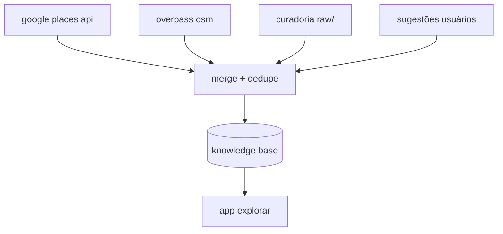

# atualização contínua de lugares

como manter o cadastro de lugares **sempre atualizado** sem depender só de edição manual — incluindo integração com **google maps** (via api oficial) e fontes abertas.

---

## visão: três camadas de verdade

| camada | papel | frequência |
|--------|-------|------------|
| **curadoria turio** | lugares verificados, copy, ods, economia local | contínua |
| **sync automático** | apis (google, osm) detectam novos/fechados | diária / semanal |
| **comunidade** | usuários sugerem e corrigem | tempo real → moderação |

conflito: prioridade **curadoria > google > osm > sugestão pendente**.

---

## google maps — forma correta

**não** fazer varredura automatizada do app mobile ou site do maps (viola termos de uso do google).

usar **google places api (new)**:

| endpoint | uso |
|----------|-----|
| `places:searchNearby` | pois num raio (lat, lon, 3000 m) por tipo |
| `places:searchText` | busca “café porto alegre cidade baixa” |
| `placeDetails` | horário, telefone, site, status `OPERATIONAL` / `CLOSED_PERMANENTLY` |

### job de sincronização (backend)

```
para cada bairro ou tile da cidade:
  searchNearby(center, radius, types=[restaurant, cafe, museum, ...])
  para cada place_id:
    se não existe no kb → criar candidato
    se existe → comparar name, formatted_address, opening_hours
    se CLOSED_PERMANENTLY → marcar inactive no turio
  gravar last_sync_at + google_place_id
```

### custos e limites

- cobrança por sku (essentials, pro); orçamento mensal por cidade.
- cache agressivo: detalhes só mudam quando `sync` ou usuário abre ficha.
- chave só no servidor (`GOOGLE_PLACES_API_KEY`).

ver também [CHAVES_API.md](./CHAVES_API.md) e [APIS.md](./APIS.md).

---

## openstreetmap (alternativa / complemento)

já usado no turio para essenciais e natureza (`overpass.js`).

| vantagem | limite |
|----------|--------|
| gratuito, sem chave | dados comerciais incompletos |
| bom para parques, ônibus, vias | horário de loja nem sempre |

job semanal: overpass `amenity=*` no polígono de poa → diff com `POA_PLACES` → relatório de “faltando no turio”.

---

## detectar mudanças

| sinal | ação |
|-------|------|
| place fechado no google | `active: false`, manter histórico |
| novo pois no maps não no turio | candidato + moderação ou auto se score alto |
| endereço divergente | flag `needs_review` |
| seed antigo (> 90 dias) | re-geocode nominatim |

campo sugerido no schema:

```js
{
  googlePlaceId: null,
  osmId: null,
  lastSyncedAt: null,
  syncSource: 'manual' | 'google' | 'osm' | 'community',
  active: true,
}
```

---

## pipeline completo



deduplicação: mesmo local se distância < 50 m e nome similar (levenshtein) ou mesmo `googlePlaceId`.

---

## implementação no repositório (roadmap)

| item | status |
|------|--------|
| seed `data/poa/raw/` | feito |
| geocode pendente `poaGeocode.js` | feito |
| backend `GET /api/places` | planejado |
| worker sync google | planejado |
| admin “diff sync” | planejado |

frontend hoje lê `POA_PLACES` estático; próximo passo é hidratar do backend com etag/cache.

---

## frequência sugerida poa

| tarefa | intervalo |
|--------|-----------|
| sympla / eventos | 6 h |
| rss / redes (após ingestão) | 12 h |
| google nearby por bairro | 7 dias (rotacionar bairros) |
| overpass amenity diff | 14 dias |
| revalidar lugares com flag | sob demanda |

---

## referências

- [INGESTAO_CONTEUDO_WEB.md](./INGESTAO_CONTEUDO_WEB.md)
- [CONTRIBUICAO_USUARIOS.md](./CONTRIBUICAO_USUARIOS.md)
- [LUGARES_APIS.md](./LUGARES_APIS.md)
