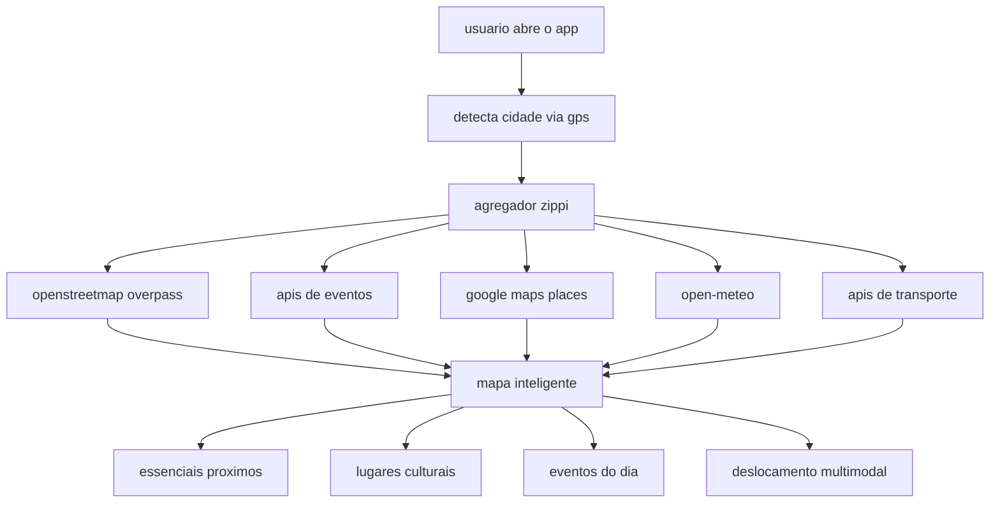

# mapeamento urbano (city mapping)

conceito central do zippi: coletar dados de múltiplas fontes, processá-los e entregar um mapa inteligente da cidade ao usuário — seja morador ou turista.

## visão geral



## o que é "mapear a cidade"

mapear significa transformar dados brutos em experiências úteis:

| camada | o que mapeia | para quem |
|--------|--------------|-----------|
| essenciais | farmácias, mercados, saúde a 3km | morador no dia a dia |
| explorar | cultura, parques, gastronomia | morador + turista |
| hoje | shows, feiras, teatros, festas | ambos |
| transporte | uber, 99, ônibus, patinetes | deslocamento |
| comunidade | alertas locais | moradores |

## pipeline de dados

### 1. detecção de contexto

```
gps → reverse geocode → { city, neighborhood, lat, lon }
hora do dia → insight contextual (café, almoço, eventos)
clima → alertas e sugestões de transporte coberto
```

### 2. coleta por viewport

quando o usuário move o mapa:

```
bounds change (debounce 500ms)
  → fetchHighwayWays(bbox)      // trânsito
  → fetchNatureFeatures(bbox)   // parques, água
```

### 3. coleta por proximidade

quando o usuário busca essenciais:

```
searchNearbyAmenities(tags, lat, lon, 3000m)
  → overpass around query
  → ordena por distância
  → retorna top 8
```

### 4. coleta por cidade (explorar/hoje)

```
exploreCity === 'poa' → EXPLORE_PLACES + EVENTS_TODAY
exploreCity === 'bentogoncalves' → EXPLORE_BENTO + EVENTS_BENTO
  → pins no mapa + lista na sheet
```

### 5. agregação de eventos (futuro)

```
sympla.api(city) + ticketmaster(city) + bilhetin(city)
  → normaliza schema comum
  → filtra gratuitos vs pagos
  → geocodifica endereços sem coordenadas
  → deduplica por título + data
  → exibe na aba hoje
```

## schema normalizado de lugar

todos os pois convergem para:

```js
{
  id: string,
  name: string,
  category: string,      // cultura | parques | gastronomia | ...
  lat: number,
  lon: number,
  desc: string,
  freeAccess: boolean,   // true = gratuito
  source: string,        // 'osm' | 'sympla' | 'curated' | ...
  city: string,
}
```

## schema normalizado de evento

```js
{
  id: string,
  title: string,
  local: string,
  bairro: string,
  time: string,
  price: string,         // 'Grátis' | 'R$ 25' | ...
  cat: string,
  lat: number,
  lon: number,
  highlight: boolean,
  source: string,
}
```

## multi-cidade

o zippi suporta explorar cidades além da localização gps:

| ação | comportamento |
|------|---------------|
| clicar "porto alegre" | flyTo poa, carrega EXPLORE_PLACES |
| clicar "bento gonçalves" | flyTo bg, carrega EXPLORE_BENTO |
| saudação | usa nome da cidade selecionada |
| essenciais | sempre usa gps real (bairro do usuário) |

## conectando moradores e turistas

- **moradores:** essenciais no bairro, alertas de trânsito, transporte otimizado
- **turistas:** explorar cultura, eventos do dia, lugares gratuitos destacados
- **ambos:** mapa unificado, mesma interface, dados da mesma cidade

## próximos passos

1. backend agregador com cache redis
2. integração sympla + ticketmaster para eventos reais
3. google places para pois comerciais enriquecidos
4. gtfs trensurb para metrô (ver `BACKLOG.md`)
5. detecção automática de cidade via limites ibge
