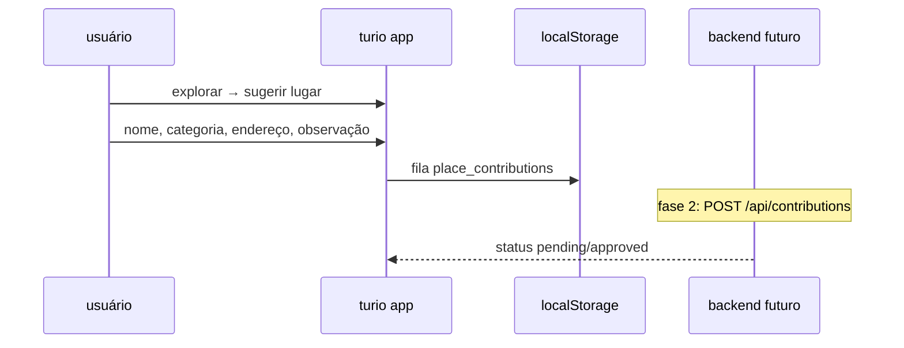

# contribuição da comunidade — lugares e correções

feature para **usuários ajudarem a manter o turio**: sugerir novos lugares, corrigir endereço, avisar que fechou.

---

## objetivos

| ação | valor |
|------|-------|
| sugerir lugar | expandir cobertura onde google/curadoria ainda não chegou |
| corrigir dados | endereço errado, nome antigo |
| marcar fechado | remover do mapa ativo |
| confirmar existência | upvote em sugestões de outros |

---

## fluxo ux (mvp implementado no app)



### tela atual

- botão **sugerir lugar** na aba explorar (porto alegre).
- modal: nome, categoria, endereço ou posição do mapa, comentário opcional.
- armazenamento local: `turio-place-contributions` (até backend existir).

arquivos:

- `frontend/src/services/placeContributions.js`
- `frontend/src/components/SuggestPlaceModal.jsx`

---

## modelo de dados (sugestão)

```js
{
  id: 'pc_...',
  type: 'suggest_place' | 'fix_address' | 'mark_closed',
  name: string,
  category: string,       // mapFilter id
  address: string,
  lat, lon,               // opcional se veio do gps
  note: string,
  userId: string | null,  // após login
  status: 'pending' | 'approved' | 'rejected',
  createdAt: number,
  upvotes: number,
}
```

---

## moderação (backend)

| regra automática | regra humana |
|------------------|--------------|
| geocode ok + categoria válida | admin aprova em 48 h |
| duplicata a 80 m de lugar existente | merge ou rejeitar |
| spam (mesmo usuário > 10/dia) | bloqueio temporário |

após aprovação:

1. `normalizePlace` + `resolveNeighborhood`
2. insert em kb com `syncSource: 'community'`, `confidence: 0.7`
3. notificação opcional ao autor (“seu lugar entrou no mapa”)

---

## gamificação (fase 2)

- pontos por sugestão aprovada.
- badge “guardião do bairro” após 5 aprovações no mesmo `neighborhoodId`.
- ranking leve no perfil (sem competir com segurança/ods).

---

## api planejada

| método | rota | descrição |
|--------|------|-----------|
| POST | `/api/contributions` | nova sugestão (auth jwt) |
| GET | `/api/contributions/mine` | histórico do usuário |
| PATCH | `/api/admin/contributions/:id` | aprovar/rejeitar |
| POST | `/api/contributions/:id/upvote` | confirmação comunidade |

---

## integração com outras fontes

| fonte | relação |
|-------|---------|
| google sync | sugestão aprovada pode ganhar `googlePlaceId` no próximo sync |
| ingestão web | post instagram vira candidato; usuário pode **confirmar** o mesmo lugar |
| relatos mapa | `community.js` continua para trânsito/perigo; lugares usam fluxo separado |

---

## privacidade

- não publicar nome do usuário no pin.
- fotos enviadas: consentimento explícito + moderação (fase 3).
- lgpd: direito de apagar contribuições (`DELETE /api/contributions/:id`).

---

## próximos passos de código

1. endpoint backend + persistência postgres.
2. painel admin mínimo (lista pending).
3. substituir localStorage por sync após login.
4. notificar quando lugar sugerido aparecer no raio 3 km do autor.

ver [FEATURES.md](./FEATURES.md) para atualizar a lista de features do produto.
