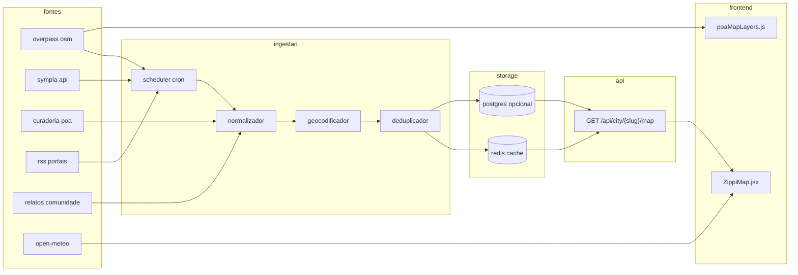

# dados urbanos e mapa dinâmico — turio

especificação do pipeline que transforma fontes brutas (osm, apis, curadoria, comunidade) em camadas acionáveis no mapa turio. complementa [CITY_MAPPING.md](./CITY_MAPPING.md) e [DATA_SOURCES.md](./DATA_SOURCES.md).

---

## visão geral do pipeline



---

## fontes de dados por camada

| camada mapa | fonte primária | fallback | arquivo atual |
|-------------|----------------|----------|---------------|
| base tiles | carto cdn | — | `ZippiMap.jsx` |
| lugares explorar | curadoria `data/poa/raw/*` | overpass amenities | `data/poa/index.js` |
| eventos hoje | sympla backend | `events.js` mock | `symplaService.js` |
| essenciais | overpass around 3km | nominatim | `essentialsSearch.js` |
| trânsito | overpass highways + mock níveis | estático poa | `poaMapLayers.js` |
| natureza | overpass parks/water | mockNature merge | `overpass.js`, `poaMapLayers.js` |
| paradas ônibus | overpass | — | `overpass.js` |
| patinetes | gbfs operadores | vazio | `scooters.js` |
| clima | open-meteo | — | `weather.js` |
| comunidade | localStorage → futuro api | — | `community.js` |

---

## integração overpass no frontend (estado atual)

### serviço genérico — `frontend/src/services/overpass.js`

funções exportadas:
- `fetchHighwayWays(bbox)` — vias primary+ para camada trânsito
- `fetchNatureFeatures(bbox)` — parques, jardins, água
- `searchNearbyAmenities(tags, lat, lon, radiusM)` — essenciais
- `fetchBusStops(bbox)` — paradas quando rota ativa

**cache:** sessionStorage, chave `zippi_osm_{kind}_{bbox}`, ttl 24h.

**endpoints:** primário `overpass-api.de`, fallback `overpass.kumi.systems`.

**user-agent:** `TurioApp/1.0 (porto alegre urban copilot; contact: dev@turio.app)`.

### serviço poa especializado — `frontend/src/services/poaMapLayers.js`

- bbox fixo poa (`POA_BBOX` em `osmGeometry.js`)
- merge geometria osm com dados mock trânsito (`portoAlegreTrafficData.js`)
- cache localStorage ttl 7 dias (`turio_poa_traffic_osm_v3`, `turio_poa_nature_osm_v3`)
- parsing via `parseNatureElements` em `osmGeometry.js`

**fluxo trânsito poa:**
1. carregar segmentos mock com nomes de vias
2. query overpass por bbox expandido
3. `nameMatchesWay` + `slicePathBetweenAnchors` alinha polyline real à simulação
4. aplicar nível congestionamento do mock sobre geometria real

---

## modelos de dados normalizados

### lugar (place)

```json
{
  "id": "poa-cultura-mcas",
  "name": "margs — museu de arte do rs",
  "category": "cultura",
  "subcategory": "museu",
  "lat": -30.0494,
  "lon": -51.2289,
  "desc": "acervo de arte gaúcha e exposições temporárias",
  "address": {
    "street": "praça da alfândega",
    "neighborhood": "centro histórico",
    "city": "porto alegre",
    "state": "rs",
    "postcode": "90010-150"
  },
  "freeAccess": true,
  "openingHours": "ter-dom 10h-19h",
  "tags": ["museu", "família", "centro"],
  "source": "curated",
  "sourceId": "mcas-001",
  "confidence": 0.95,
  "confidenceFactors": {
    "sourceReliability": 0.9,
    "geoVerified": 1.0,
    "freshnessDays": 14,
    "communityConfirmations": 3
  },
  "updatedAt": "2026-05-15T10:00:00Z"
}
```

### evento (event)

```json
{
  "id": "evt-sympla-123456",
  "title": "feira eco local bom fim",
  "local": "praça júlio de castilhos",
  "bairro": "bom fim",
  "city": "porto alegre",
  "state": "rs",
  "lat": -30.034,
  "lon": -51.21,
  "startAt": "2026-05-31T09:00:00-03:00",
  "endAt": "2026-05-31T18:00:00-03:00",
  "time": "09:00",
  "price": "grátis",
  "priceValue": 0,
  "cat": "feira",
  "highlight": true,
  "source": "sympla",
  "sourceUrl": "https://sympla.com.br/...",
  "confidence": 0.88,
  "confidenceFactors": {
    "sourceReliability": 0.85,
    "geoVerified": 0.9,
    "freshnessDays": 1,
    "ticketAvailable": true
  },
  "updatedAt": "2026-05-30T08:00:00Z"
}
```

### segmento de trânsito (traffic)

```json
{
  "id": "traffic-poa-ipiranga-001",
  "name": "av. ipiranga",
  "highway": "primary",
  "path": [[-30.034, -51.218], [-30.031, -51.215]],
  "level": "heavy",
  "levelScore": 0.75,
  "speedKmh": 18,
  "source": "simulated",
  "confidence": 0.45,
  "confidenceFactors": {
    "sourceReliability": 0.4,
    "geometryReal": 1.0,
    "communityReports": 2,
    "lastProbeMinutes": null
  },
  "updatedAt": "2026-05-31T07:30:00Z"
}
```

### relato comunidade (community report)

```json
{
  "id": "report-uuid-789",
  "type": "obra",
  "lat": -30.027,
  "lon": -51.205,
  "message": "interdição parcial faixa leste",
  "authorHash": "anon-a1b2",
  "votesUp": 5,
  "votesDown": 0,
  "status": "validated",
  "confidence": 0.82,
  "expiresAt": "2026-06-07T12:00:00Z",
  "createdAt": "2026-05-31T06:00:00Z"
}
```

---

## campo confidence — especificação

score final **0.0 – 1.0** calculado como média ponderada:

| fator | peso | descrição |
|-------|------|-----------|
| sourceReliability | 0.35 | curated=0.95, sympla=0.85, osm=0.7, user=0.5, simulated=0.4 |
| geoVerified | 0.25 | coordenadas conferidas vs geocode |
| freshness | 0.20 | decai após 7/30/90 dias conforme tipo |
| communityConfirmations | 0.20 | relatos ou upvotes convergentes |

**regras de ui:**
- confidence >= 0.8 — exibir normalmente
- 0.5 – 0.79 — badge "verificar horário"
- < 0.5 — badge "estimativa" ou ocultar em filtros "somente verificados"

```javascript
function computeConfidence(factors) {
  const freshnessScore = Math.max(0, 1 - factors.freshnessDays / 90)
  const communityScore = Math.min(1, factors.communityConfirmations / 5)
  return (
    0.35 * factors.sourceReliability +
    0.25 * factors.geoVerified +
    0.20 * freshnessScore +
    0.20 * communityScore
  )
}
```

---

## scheduler de ingestão (backend)

### jobs cron propostos

| job | frequência | ação |
|-----|------------|------|
| `sync-sympla-poa` | 6h | buscar eventos poa/rs, normalizar, cache redis |
| `sync-sympla-bento` | 12h | idem bento gonçalves |
| `scrape-cultura-rs` | 24h | rss cultura.rs.gov.br |
| `warm-overpass-poa` | 24h | pré-cache bbox poa trânsito+natureza |
| `expire-reports` | 1h | remover relatos expirados |
| `recompute-confidence` | 24h | recalcular scores |

### implementação sugerida

```
backend/src/
├── jobs/
│   ├── scheduler.js      # node-cron ou bullmq
│   ├── syncSympla.js
│   └── warmOverpass.js
├── pipelines/
│   ├── normalizePlace.js
│   ├── normalizeEvent.js
│   └── deduplicate.js
└── routes/
    └── cityMap.js        # GET /api/city/:slug/map
```

**variáveis de ambiente:** `SYMPLA_TOKEN`, `REDIS_URL`, `JOB_SECRET` (proteger endpoints de cron na vercel).

---

## deduplicação

mesmo lugar pode aparecer em osm, curadoria e google.

**estratégia:**
1. hash geográfico geohash precision 7 (~150m)
2. similaridade nome (levenshtein < 0.2)
3. merge: preferir curated > sympla > osm para metadados; union de tags
4. manter `sources: [{ type, id, confidence }]` para auditoria

---

## resposta agregada da api

```json
{
  "city": "poa",
  "slug": "porto-alegre",
  "bbox": { "south": -30.27, "west": -51.29, "north": -30.01, "east": -51.01 },
  "generatedAt": "2026-05-31T12:00:00Z",
  "layers": {
    "places": { "items": [], "count": 142, "avgConfidence": 0.91 },
    "events": { "items": [], "count": 23, "avgConfidence": 0.86 },
    "traffic": { "items": [], "count": 89, "avgConfidence": 0.52 },
    "nature": { "items": [], "count": 34, "avgConfidence": 0.88 },
    "community": { "items": [], "count": 7, "avgConfidence": 0.75 }
  },
  "meta": {
    "sources": ["curated", "sympla", "overpass", "community"],
    "cacheHit": true,
    "ttlSeconds": 3600
  }
}
```

query params: `?layers=events,traffic&minConfidence=0.6&bbox=s,w,n,e`

---

## fluxo no frontend após agregador

1. `Home.jsx` detecta cidade via gps
2. fetch `/api/city/poa/map?layers=places,events,traffic,nature`
3. `ZippiMap.jsx` renderiza geojson por camada
4. pan/zoom adicional: overpass incremental para bbox visível (debounce 500ms)
5. merge client-side com relatos localStorage até api comunidade existir

---

## curadoria poa — estrutura de arquivos

```
frontend/src/data/poa/
├── index.js              # export unificado POA_PLACES
├── normalize.js          # schema comum + confidence default
├── mapCategories.js      # categorias ui
├── coords.js             # centroides
├── raw/
│   ├── cultura.js
│   ├── gastronomia.js
│   ├── cafes.js
│   ├── natureza.js
│   ├── farmacias.js
│   ├── eventosMock.js
│   └── ...
├── portoAlegreTrafficData.js
└── trafficMock.js
```

**adicionar novo lugar:** editar arquivo raw da categoria → rodar normalize → pin aparece no mapa.

---

## qualidade e monitoramento

| métrica | alerta |
|---------|--------|
| latência overpass p95 | > 8s |
| taxa erro sympla | > 5% |
| avg confidence places | < 0.7 |
| stale events (> 48h não atualizados) | > 20% |
| cache hit rate agregador | < 60% |

---

## roadmap pipeline

| fase | entrega |
|------|---------|
| 1 (atual) | overpass frontend + curadoria + sympla proxy |
| 2 | confidence field + normalize.js unificado |
| 3 | scheduler sympla + warm overpass backend |
| 4 | GET /api/city/poa/map |
| 5 | deduplicação + postgres opcional |
| 6 | trânsito real + comunidade api |

---

## referências

- [APIS.md](./APIS.md)
- [DATA_SOURCES.md](./DATA_SOURCES.md)
- [BACKLOG_SCRUMBAN.md](./BACKLOG_SCRUMBAN.md) — turio-102, turio-103, turio-301
