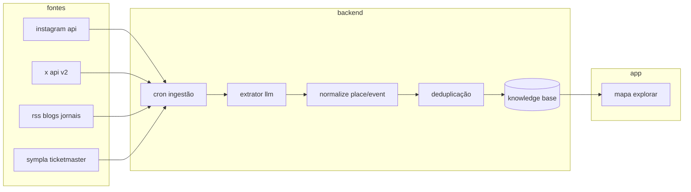

# ingestão de conteúdo web — lugares e eventos

como montar a ia e o backend para ler **instagram**, **x (twitter)**, **blogs**, **jornais** e outras fontes, extrair lugares/eventos e alimentar o tourio. complementa [ARQUITETURA_IA.md](./ARQUITETURA_IA.md) e [TREINAMENTO_IA_MODELOS.md](./TREINAMENTO_IA_MODELOS.md).

---

## princípio legal e técnico

| regra | motivo |
|-------|--------|
| preferir **apis oficiais** e rss públicos | scraping de instagram/x viola termos e quebra fácil |
| processar no **backend** (nunca chave no app) | segurança e rate limit centralizado |
| salvar só **metadados permitidos** + link da fonte | direitos autorais e atribuição |
| pipeline **humano na curadoria** até confiança alta | evitar alucinação de endereço |

não recomendado: bots que fazem login e raspam feed sem contrato — risco jurídico e bloqueio.

---

## arquitetura geral



---

## instagram

### o que é possível hoje

| método | o que obtém | requisito |
|--------|-------------|-----------|
| **instagram graph api** (meta) | posts de contas **business/creator** que autorizaram o app | app meta, revisão de permissões |
| **hashtag / local** | mídia pública limitada | permissões `instagram_basic`, parcerias |
| scraping não oficial | feed completo | **não usar em produção** |

### fluxo recomendado

1. cadastrar contas parceiras (prefeitura, casas de show, bares, veículos de cultura).
2. oauth: página conecta ao app meta.
3. job a cada 6–12 h: `GET /{ig-user-id}/media` → legenda, timestamp, permalink, mídia.
4. **llm extrator** (prompt estruturado json):

```json
{
  "tipo": "evento | lugar | promoção | irrelevante",
  "nome": "",
  "endereco_texto": "",
  "data_inicio": "",
  "categoria": "",
  "confianca": 0.0
}
```

5. geocode nominatim se não houver coordenadas.
6. fila de moderação → `status: pending | approved | rejected`.

### palavras-chave poa

hashtags e menções curadas: `#portoalegre`, `#poa`, `#cidadebaixa`, `#redenção`, perfis de agenda cultural (zh, trip, sympla reposts).

---

## x (twitter)

| método | custo | uso |
|--------|-------|-----|
| **x api v2** — search recent | pago por tier | monitorar queries `porto alegre evento`, `show poa` |
| **contas oficiais** via `user/tweets` | mesmo | prefeitura, cultura, jornalistas |
| nitter / scraping | instável | só pesquisa, não produção |

pipeline igual ao instagram: tweet → llm → evento candidato → geocode → moderação.

alternativa barata: **rss** de portais que republicam twitter (muitos jornais já têm feed).

---

## blogs e jornais

### fontes típicas poa

| tipo | exemplo | técnica |
|------|---------|---------|
| jornal | g1 rs, zero hora, jornal do comércio | rss ou sitemap + fetch artigo |
| blog cultural | agenda zh, trip, blogs locais | rss |
| prefeitura / smc | releases oficiais | rss/html lista |

### pipeline rss (backend node ou python)

```
fetch rss url
  → parse item (title, description, link, pubDate)
  → strip html
  → llm: extrair { eventos[], lugares[] }
  → match com kb existente (nome + endereço fuzzy)
  → insert ou update com source_url + fetched_at
```

ferramentas: `rss-parser` (node), `feedparser` (python), fila **bullmq** ou cron **github actions** + webhook.

### prompt de extração (sistema 1)

- entrada: título + corpo (máx 8k tokens).
- saída: json schema validado (zod).
- regra: “se endereço incompleto, marque `geocode_pending: true`”.

---

## ia de extração (núcleo comum)

um único serviço `ContentExtractor` para todas as fontes:

| etapa | tecnologia |
|-------|------------|
| classificar relevância | modelo pequeno ou regex + llm |
| extrair entidades | gpt-4o-mini / gemini flash com json mode |
| normalizar | mesmo `normalizePlace` do frontend |
| enriquecer | `classifyUrbanData` + bairro `resolveNeighborhood` |
| confiança | score por fonte (oficial 0.9, social 0.6, blog 0.75) |

treino poa: ver [TREINAMENTO_IA_MODELOS.md](./TREINAMENTO_IA_MODELOS.md) — dataset de posts já rotulados manualmente.

---

## armazenamento sugerido (backend)

```sql
-- candidatos antes de ir ao app
content_sources (id, type, url, fetched_at)
content_raw (id, source_id, body, metadata jsonb)
place_candidates (id, raw_id, name, address, lat, lon, confidence, status)
event_candidates (id, raw_id, title, starts_at, venue_name, ...)
```

aprovados viram linhas em `places` / `events` consumidas pelo app (`GET /api/places?city=poa`).

---

## cronograma mvp

| fase | entrega |
|------|---------|
| 1 | rss de 3 portais + sympla já ativo |
| 2 | llm extrator + fila moderação admin simples |
| 3 | 5 contas instagram parceiras (graph api) |
| 4 | x api com 10 queries fixas poa |
| 5 | rs: replicar feeds por cidade |

---

## referências

- meta developers — instagram graph api
- developer.x.com — api v2
- [APIS.md](./APIS.md) — sympla, nominatim
- [ATUALIZACAO_LUGARES.md](./ATUALIZACAO_LUGARES.md) — google maps / osm
- [CONTRIBUICAO_USUARIOS.md](./CONTRIBUICAO_USUARIOS.md) — comunidade
